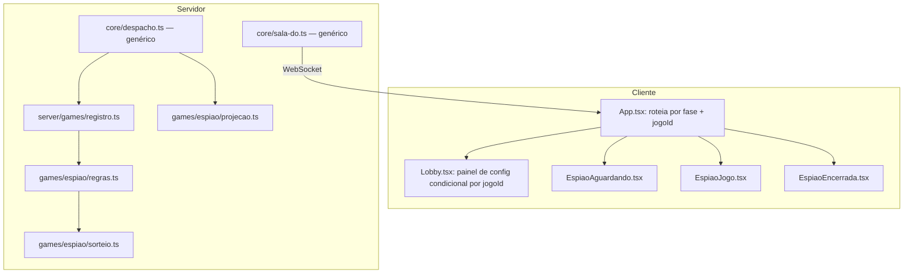

# Espião Design

**Spec**: `.specs/features/espiao/spec.md`
**Status**: Draft

---

## Architecture Overview

Espião entra no hub exatamente pelo mecanismo que `hub-selecao-jogos` construiu para isso: um segundo módulo no registro (`AD-013`), sem o `core` importar nada de `games/espiao/` (`AD-002`). Nenhuma peça de transporte, persistência ou ciclo de vida da sala muda — `sala-do.ts`, `despacho.ts` e `index.ts` continuam genéricos.

O que esta feature de fato precisa resolver, e que `hub-selecao-jogos` deixou em aberto de propósito (`AD-013`'s nota "reavaliar quando o Espião definir sua própria necessidade"): `Config` e `Projecao.jogo` hoje são objetos únicos moldados 100% em cima de "Quem Sou Eu", e Espião precisa de campos, fases internas e uma tela completamente diferentes. A decisão confirmada (`AD-014`, abaixo) é: um campo aninhado por jogo em `Config`/`Projecao.jogo` (`config.espiao`, `jogo.espiao`), não um novo campo achatado no topo e não um redesenho genérico de `Config`/`Projecao`.



---

## Code Reuse Analysis

### Existing Components to Leverage

| Component | Location | How to Use |
| --- | --- | --- |
| Registro por `jogoId` | `server/games/registro.ts` | Adiciona uma linha: `'espiao': espiao as JogoDaSala<unknown>` |
| Contrato de 3 funções puras | `shared/protocolo.ts` (`ModuloDeJogo`) | `games/espiao/` implementa `iniciarRodada`/`reduzir`/`projetar`, mesmo formato de `games/quem-sou-eu/` |
| Sistema de pacotes (conteúdo + KV + fallback estático) | `shared/pacotes.ts`, `shared/pacotes-dados.ts`, `despacho.ts::buscarPacotes` | Reaproveitado por inteiro: `PacoteCompleto`/`CartaDoPacote`/`Dificuldade`/`montarPoolDeCartas` servem tanto para "cartas" quanto para "locais" — um local é só uma `carta` com um texto e uma dificuldade. Locais entram num **novo** array de dados (`shared/locais-dados.ts`), não misturado com `shared/pacotes-dados.ts` |
| `Config.pacoteIds`/`modoPacote`/`dificuldades` | `shared/protocolo.ts`, `despacho.ts::configurar/configValida` | Reaproveitados sem mudança — Espião sempre opera com `modoPacote === 'pacote'` (não existe "escrita livre" de local) |
| Bloco de notas privado | `server/core` (comando `notas`, já genérico em `despacho.ts`) | Zero mudança no `core`; Espião implementa sua própria `escreverNotas` (mesma função de ~5 linhas que "Quem Sou Eu" já tem — duplicar é mais barato que extrair um util cross-game por 2 jogos) |
| `venceuPrazoTurno` (aviso genérico do alarme) | `server/core/sala-do.ts::alarm()` | Já dispara para qualquer jogo via `avisar()`; Espião trata esse aviso como "tempo da rodada esgotou" |
| `Prazos.turno` (relógio mux'ado, `AD-010`) | `shared/protocolo.ts`, `server/core/prazos.ts` | Reaproveitado como o relógio da rodada de Espião — uma sala só roda um jogo por vez, não há conflito |
| Comandos `marcarPronto`, `encerrar`, `novaPartida`, `notas` | `shared/protocolo.ts` (`Comando`) | Reaproveitados tal como estão — mesmo nome, mesma semântica ("estou pronto", "host encerra", "nova partida", "escrever nota"), roteados genericamente pelo `default:` de `despacho.ts::executar()` |
| `embaralhar()` (Fisher-Yates) | `server/games/quem-sou-eu/sorteio.ts` | Não importado (jogos são isolados, `AD-002`) — reimplementado como `server/games/espiao/sorteio.ts`, mesma função, ~15 linhas duplicadas |
| `SeletorDeJogos`, `Modal.tsx`, `Botao.tsx`, `BlocoDeNotas.tsx`, `FichaDeJogador.tsx`, `Chat.tsx` | `client/src/componentes/` | Reaproveitados como estão nas novas telas de Espião |
| Padrão de seleção de pacotes no lobby (`pacoteIdsRascunho`, modal "Ver cartas") | `client/src/telas/Lobby.tsx` | Mesmo padrão de rascunho + confirmar/cancelar, reaproveitado para seleção de pacotes de locais |

### Integration Points

| System | Integration Method |
| --- | --- |
| `App.tsx` (roteamento de tela por `fase`) | Ganha um segundo eixo de decisão: quando `fase === 'jogo'` ou `fase === 'encerrada'`, escolhe entre a tela de "Quem Sou Eu" e a de Espião conforme `projecao.sala.jogoId`. `fase === 'escrita'` nunca acontece pra Espião (nunca é `faseSeguinte` retornado por `iniciarRodada`) |
| `Lobby.tsx` (painel de configuração) | Ganha um bloco condicional (`jogoId === 'espiao'`) com os controles de Espião, ao lado do bloco existente de "Quem Sou Eu" (que passa a também virar condicional por `jogoId === 'quem-sou-eu'`) |
| Catálogo de pacotes disponíveis (`sala-do.ts::confirmar/getPacotesDisponiveis`) | Filtra a lista pelo `jogoId` da sala antes de anexar à projeção — sem isso um lobby de Espião veria pacotes de cartas de "Quem Sou Eu" como opção |
| `shared/jogos-catalogo.ts` | Ganha a entrada `espiao` no `CATALOGO_DE_JOGOS`, e o catálogo passa a carregar `minJogadores` por jogo (ver `AD-014`) |

---

## Components

### `shared/locais-dados.ts` (novo)

- **Purpose**: Conteúdo estático dos pacotes de locais de Espião, mesmo formato de `pacotes-dados.ts`.
- **Location**: `shared/locais-dados.ts`
- **Interfaces**: `export const LOCAIS: PacoteCompleto[]` — reaproveita `PacoteCompleto`/`CartaDoPacote` de `shared/pacotes-dados.ts` (importa o tipo, não os dados)
- **Dependencies**: `shared/pacotes-dados.ts` (só os tipos `PacoteCompleto`/`CartaDoPacote`/`Dificuldade`)
- **Reuses**: mesmo formato de dados, mesma função `montarPoolDeCartas` do lado do jogo pra combinar pacotes selecionados num pool

### `server/games/espiao/regras.ts` (novo)

- **Purpose**: Reducer puro do jogo — sorteio de local/espiões, PRONTO, votação, encerramento.
- **Location**: `server/games/espiao/regras.ts`
- **Interfaces**:
  - `estadoVazio(): EstadoEspiao`
  - `iniciarRodada(ctx, ambiente, pacotes?): ResultadoInicio<EstadoEspiao>`
  - `reduzir(estado, ctx, comando, ambiente): ResultadoReducer<EstadoEspiao>`
- **Dependencies**: `shared/protocolo.ts`, `shared/pacotes.ts` (`montarPoolDeCartas`), `server/games/espiao/sorteio.ts`
- **Reuses**: mesmo formato de `games/quem-sou-eu/regras.ts` — reducer por `switch (comando.t)`, cada caso validando fase/autoridade antes de mutar uma cópia clonada do estado

### `server/games/espiao/sorteio.ts` (novo)

- **Purpose**: Aleatoriedade injetada — sorteio de local, espiões e quem começa perguntando.
- **Location**: `server/games/espiao/sorteio.ts`
- **Interfaces**:
  - `embaralhar<T>(itens: readonly T[], aleatorio: () => number): T[]` (Fisher-Yates genérico, duplicado de `quem-sou-eu/sorteio.ts`)
  - `sortearEspioes(ativos: JogadorId[], quantidade: number, aleatorio: () => number): JogadorId[]`
- **Dependencies**: nenhuma (função pura)
- **Reuses**: mesmo algoritmo Fisher-Yates já usado em "Quem Sou Eu"

### `server/games/espiao/projecao.ts` (novo)

- **Purpose**: Monta a `Projecao.jogo.espiao` de um jogador específico a partir do `EstadoEspiao` — esconde local de quem é espião, esconde outros espiões conforme config, esconde votos conforme visibilidade configurada.
- **Location**: `server/games/espiao/projecao.ts`
- **Interfaces**: `projetar(estado: EstadoEspiao | null, sala: EstadoSala<EstadoEspiao>, paraJogador: JogadorId): Projecao`
- **Dependencies**: `shared/protocolo.ts`
- **Reuses**: mesmo formato de `games/quem-sou-eu/projecao.ts` (monta o objeto `Projecao` completo: `sala`, `eu`, `jogadores`, `jogo`, `chat`)

### `server/games/espiao/index.ts` (novo)

- **Purpose**: Monta o módulo `ModuloDeJogo<EstadoEspiao, ComandoEspiao>` — o único ponto de saída do pacote `games/espiao/`.
- **Location**: `server/games/espiao/index.ts`
- **Reuses**: idêntico em forma a `games/quem-sou-eu/index.ts`

### `server/games/registro.ts` (modificado)

- **Purpose**: Adiciona a entrada `'espiao'`.
- **Location**: `server/games/registro.ts`
- **Mudança**: `REGISTRO_DE_JOGOS = { 'quem-sou-eu': ..., 'espiao': espiao as JogoDaSala<unknown> }`

### `server/core/sala-do.ts` (modificado — só filtro de pacotes)

- **Purpose**: `getPacotesDisponiveis()`/`confirmar()` passam a filtrar o catálogo global de pacotes pelo `jogoId` da sala.
- **Mudança pontual**: `pacotes.filter((p) => p.jogoId === sala.jogoId)` antes de anexar à projeção. Não introduz import de `games/` — só lê um campo (`jogoId`) que passa a existir em `PacoteResumo`, do mesmo jeito que já lê `sala.jogoId` hoje.

### `shared/protocolo.ts` (modificado)

- **Purpose**: Novos tipos e campos do contrato.
- **Mudanças**:
  - `Comando` ganha `abrirVotacao`, `votar` (`{ alvoId: JogadorId | null }`), `encerrarVotacao`
  - `Config` ganha o campo obrigatório `espiao: ConfigEspiao` (sempre presente — `CONFIG_PADRAO` já populado com os defaults de Espião, do mesmo jeito que já populam `dificuldades`/`modoDistribuicao` mesmo quando a sala roda "Quem Sou Eu")
  - `Projecao.jogo` ganha o campo opcional `espiao?: ProjecaoEspiao`
  - `PacoteResumo` ganha o campo obrigatório `jogoId: string`
  - `CodigoErro`: nenhum novo — reaproveita `JOGADORES_INSUFICIENTES`, `SEM_AUTORIDADE`, `FASE_INVALIDA`, `COMANDO_INVALIDO`, `PACOTE_NAO_ENCONTRADO`, `PACOTE_INSUFICIENTE`

### `shared/jogos-catalogo.ts` (modificado)

- **Purpose**: Ganha a entrada de Espião e o campo `minJogadores` por jogo.
- **Mudança**: `JogoCatalogo` ganha `minJogadores: number`; `quem-sou-eu` declara `2`; nova entrada `espiao` declara `nome: 'Espião'`, `minJogadores: 3`

### Cliente — `client/src/telas/EspiaoAguardando.tsx`, `EspiaoJogo.tsx`, `EspiaoEncerrada.tsx` (novas)

- **Purpose**: As três telas de Espião, roteadas por `App.tsx` conforme `fase` + `jogoId === 'espiao'`.
- **Reuses**: `Shell.tsx`, `FichaDeJogador.tsx`, `Chat.tsx`, `BlocoDeNotas.tsx`, `Botao.tsx`, `Modal.tsx` (pra tela de votação)

### `client/src/telas/App.tsx` (modificado)

- **Mudança**: o `switch (projecao.sala.fase)` para os casos `'jogo'` e `'encerrada'` passa a checar `projecao.sala.jogoId` antes de escolher entre a tela de "Quem Sou Eu" e a de Espião.

### `client/src/telas/Lobby.tsx` (modificado)

- **Mudança**: o painel de configuração existente (ordem de turnos, tempo por turno, pacotes de cartas) vira condicional a `jogoId === 'quem-sou-eu'`; um novo bloco condicional a `jogoId === 'espiao'` mostra: nº de espiões, espiões se veem, visibilidade do voto, tempo de rodada, seleção de pacotes de locais (mesmo padrão de rascunho + modal "Ver locais" já usado pros pacotes de cartas).

---

## Data Models

### `EstadoEspiao` (server, opaco pro `core`)

```typescript
interface EstadoEspiao {
  /** Nunca enviado a um jogador espião antes da revelação. */
  local: string
  /** 1+ jogadores, conforme `config.espiao.numEspioes`. */
  espioes: JogadorId[]
  /** Sorteado ao iniciar; só informativo — nunca vira estado de turno. */
  comecaPerguntando: JogadorId
  /** Fase "aguardando prontos" — some quando `rodadaIniciada` vira true. */
  prontos: JogadorId[]
  /** false = tela de espera por PRONTO; true = tela padrão do jogo. */
  rodadaIniciada: boolean
  votacaoAberta: VotacaoAberta | null
  /** Mesmo padrão de `pacotesSelecionados` de "Quem Sou Eu" — visível durante o jogo. */
  pacotesSelecionados?: { id: string; nome: string; emoji: string }[]
}

interface VotacaoAberta {
  abertaEm: number
  /** votante → alvo (`'pular'` é a opção de não acusar ninguém). */
  votos: Record<JogadorId, JogadorId | 'pular'>
}
```

### `ConfigEspiao` (novo, aninhado em `Config.espiao`)

```typescript
interface ConfigEspiao {
  /** Padrão 1. Validado estruturalmente aqui; validado contra o nº de jogadores ativos só no início da rodada (ver `ESP-02`). */
  numEspioes: number
  /** Padrão true. */
  espioesSeVeem: boolean
  /** Padrão 'oculta'. */
  visibilidadeVoto: 'oculta' | 'tempoReal'
  /** Padrão 300 (5min). `null` = sem limite, mesmo padrão de `tempoTurnoSeg`. */
  tempoRodadaSeg: number | null
}

const CONFIG_ESPIAO_PADRAO: ConfigEspiao = {
  numEspioes: 1,
  espioesSeVeem: true,
  visibilidadeVoto: 'oculta',
  tempoRodadaSeg: 300,
}
```

### `ProjecaoEspiao` (novo, aninhado em `Projecao.jogo.espiao`)

```typescript
interface ProjecaoEspiao {
  comecaPerguntando: { id: JogadorId; apelido: string }
  rodadaIniciada: boolean
  prontos: number
  total: number
  /** Instante absoluto de vencimento do relógio da rodada; `null` = sem limite ou relógio pausado (votação aberta). */
  prazoRodada: number | null
  souEspiao: boolean
  /** Presente quando `!souEspiao`, ou quando a partida está `encerrada` (revelado a todos). */
  local?: string
  /** Presente quando (`souEspiao && config.espiao.espioesSeVeem`), ou quando `encerrada`. */
  espioes?: { id: JogadorId; apelido: string }[]
  votacaoAberta?: {
    meuVoto: JogadorId | 'pular' | null
    quantosVotaram: number
    total: number
    /** Presente só se `config.espiao.visibilidadeVoto === 'tempoReal'`. */
    votos?: Record<JogadorId, JogadorId | 'pular'>
  }
}
```

**Relationships**: `EstadoEspiao` vive em `EstadoSala.jogo` quando `sala.jogoId === 'espiao'` (mesmo slot genérico `E` que "Quem Sou Eu" usa — `AD-013`). `ConfigEspiao` vive em `EstadoSala.config.espiao`, sempre presente independente de qual jogo está ativo (mesmo comportamento que os campos de "Quem Sou Eu" em `Config` hoje).

---

## Error Handling Strategy

| Error Scenario | Handling | User Impact |
| --- | --- | --- |
| Menos de 3 jogadores ativos ao clicar Começar | `iniciarRodada` recusa com `JOGADORES_INSUFICIENTES` (mesmo padrão de "Quem Sou Eu", limite diferente) | Botão mostra o motivo, mesmo texto/padrão já usado |
| Nº de espiões configurado não deixa 2+ não-espiões | `iniciarRodada` recusa com `JOGADORES_INSUFICIENTES` (reaproveitado, sem novo código de erro — ver nota no spec) | Mesma mensagem de jogadores insuficientes |
| Nenhum pacote de locais selecionado | `iniciar()` em `despacho.ts` já recusa com `PACOTE_NAO_ENCONTRADO` antes de chamar `iniciarRodada` (mesmo caminho de "Quem Sou Eu" quando `modoPacote === 'pacote'` e `pacoteIds` vazio) | Mesma mensagem de pacote não encontrado |
| Comando de votação (`votar`/`abrirVotacao`/`encerrarVotacao`) fora da fase/estado certo | `reduzir` recusa com `FASE_INVALIDA` ou `COMANDO_INVALIDO`, mesmo padrão de "Quem Sou Eu" | Sem efeito, sala como estava |
| `votar` com `alvoId` que não é jogador ativo | `COMANDO_INVALIDO` | Sem efeito |
| `encerrarVotacao`/`encerrar` por não-host | `SEM_AUTORIDADE` | Sem efeito |
| Jogador sai deixando ativos < 3 durante a rodada | Mesmo padrão de "Quem Sou Eu": cancela a partida, evento de sistema, volta ao lobby, promove `aguardando` | Sala volta ao lobby com aviso no chat |
| Único espião sai e sobram ativos suficientes | Partida segue sem espião algum (ver Assumption já registrada no spec) | Votação nunca mais acerta; host encerra manualmente quando notar |
| Jogador desconecta durante votação aberta | Contagem de "todos votaram" considera só ativos conectados (mesmo padrão do rodízio de turnos de "Quem Sou Eu") | Votação não trava esperando quem caiu |

---

## Risks & Concerns

| Concern | Location (file:line) | Impact | Mitigation |
| --- | --- | --- | --- |
| `App.tsx` roteia telas só por `fase`, nunca por `jogoId` — achado já registrado em `hub-selecao-jogos/design.md` e deixado pendente de propósito | `client/src/App.tsx:138` | Sem mudança, Espião cairia nas telas de "Quem Sou Eu" (`Jogo.tsx`/`Encerrada.tsx`) mesmo jogando Espião | Este design resolve agora: `App.tsx` passa a checar `jogoId` nos casos `'jogo'`/`'encerrada'` (ver Components acima) |
| `Lobby.tsx` mostra o painel de config de "Quem Sou Eu" sem checar `jogoId` | `client/src/telas/Lobby.tsx` (todo o bloco de config) | Um lobby de Espião veria controles de "ordem de turnos"/"pacotes de cartas" sem sentido pro jogo ativo | Painel de config vira condicional por `jogoId`, ambos os blocos (ver Components acima) |
| Catálogo de pacotes disponíveis é global, sem filtro por jogo | `server/core/sala-do.ts:328-372` | Lobby de Espião veria "Filmes"/"Animais" (pacotes de cartas) como opção de local | `PacoteResumo` ganha `jogoId`; `confirmar()` filtra antes de anexar à projeção |
| `Config`/`Projecao.jogo` são objetos únicos, compartilhados — tensão já registrada em `AD-011`/`AD-012`, agora resolvida aqui | `shared/protocolo.ts:107-120`, `260-328` | Sem uma decisão, os campos de Espião ou colidem com os de "Quem Sou Eu" ou exigem reescrever `Config`/`Projecao` genericamente | `AD-014` (abaixo): campo aninhado por jogo, confirmado com o dono nesta sessão |

---

## Tech Decisions (only non-obvious ones)

| Decision | Choice | Rationale |
| --- | --- | --- |
| Estrutura de `Config`/`Projecao.jogo` pro segundo jogo | Campo aninhado por jogo (`config.espiao`, `jogo.espiao`) | Confirmado com o dono via 3 opções apresentadas — contém o crescimento sem achatar mais o topo do objeto nem exigir generics em toda a stack |
| Validação de "espiões vs. jogadores ativos" | No início da rodada (`iniciarRodada`), não na configuração | Nº de jogadores muda enquanto a sala está no lobby; validar só na configuração ficaria obsoleto. Reaproveita `JOGADORES_INSUFICIENTES`, sem novo código de erro |
| Critério de maioria na votação | Maioria absoluta dos jogadores **ativos** (`> metade do total`, não só de quem votou) | O spec disse "maioria decide" sem aritmética exata — fechado aqui pra não deixar ambiguidade até a implementação. Contar sobre os ativos (não só votantes) evita que poucos votos decidam numa sala grande com gente que não votou |
| Relógio da rodada durante a votação | Pausado (`prazos.turno = null`) enquanto a votação está aberta; reaberto se a votação falha | Mais simples que correr dois prazos ao mesmo tempo; não há requisito pedindo limite de tempo pra votar |
| "Dica de pergunta" | 100% client-side, sem comando nem estado no servidor | O conteúdo é uma lista estática e não afeta estado de partida algum — um round-trip aqui seria trabalho sem benefício |
| Fases (`Fase`) usadas por Espião | Só `'lobby'`, `'jogo'`, `'encerrada'` — nunca `'escrita'` | Todos os sub-estados de Espião (aguardando prontos, rodada em andamento, votação aberta) vivem dentro do próprio `EstadoEspiao`, não como novas fases genéricas — evita crescer o enum `Fase` compartilhado |
| Catálogo de pacotes filtrado por jogo | `PacoteResumo.jogoId` (tag simples), filtro em `sala-do.ts::confirmar()` | Menor mudança possível — não precisa duplicar o mecanismo de KV/fallback estático, só filtrar a lista já buscada |
| `MIN_JOGADORES` por jogo | Passa a viver como `minJogadores` em cada entrada de `shared/jogos-catalogo.ts`; a validação de verdade continua dentro do próprio `iniciarRodada` de cada jogo (já é assim hoje) | O catálogo já existe e já é a fonte de metadados por jogo (`HUB-01`/`HUB-13`/`HUB-14`) — reaproveitar evita uma segunda fonte de verdade |

> **Project-level decisions:** as duas primeiras linhas acima (estrutura de `Config`/`Projecao` e `minJogadores` por jogo) definem um padrão que o próximo jogo (Cartas Contra a Turma) também vai seguir — vão para `.specs/STATE.md` como `AD-014` depois da confirmação deste `design.md`.

---

## Tips (not part of the template — implementation notes)

- `configValida()` em `despacho.ts` precisa validar `parcial.espiao` estruturalmente (bounds de `numEspioes`, enum de `visibilidadeVoto`, bounds de `tempoRodadaSeg` reaproveitando `TEMPO_TURNO_MIN_SEG`/`TEMPO_TURNO_MAX_SEG`) — sem importar nada de `games/`, mesmo padrão dos campos de "Quem Sou Eu" já validados ali.
- `trocarJogo()` já reseta `sala.config = { ...CONFIG_PADRAO }` — com `CONFIG_PADRAO.espiao` definido, trocar de/para Espião já regenera a config certa sem mudança nenhuma nessa função.
