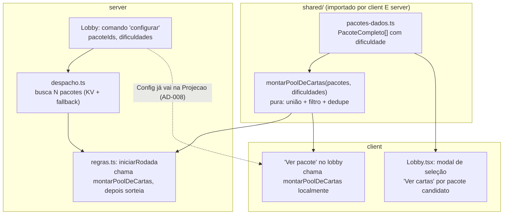

# Pacotes Avançados Design

**Spec**: `.specs/features/pacotes-avancados/spec.md`
**Status**: Draft

---

## Contexto lido antes de desenhar

- `.specs/STATE.md` `## Decisions`: `AD-002` (fronteira `core`/`games`), `AD-008` (projeções por jogador), `AD-009` (três funções puras do módulo de jogo), `AD-010` (agendador único de alarme — não afetado aqui), `AD-011` (constantes que o cliente precisa vivem em `shared/`, com tensão explícita registrada sobre isso crescer quando um segundo jogo entrar).
- Nenhuma lição `confirmed` em `.specs/LESSONS.md` ainda (todas são `candidate`, recorrência 1) — não carrego como guidance formal, mas apliquei o espírito de duas delas por conta própria: L-004 (requisito que atravessa camadas precisa de task em cada uma) e L-006 (AC de duas cláusulas precisa de duas asserções).
- Código lido: `shared/protocolo.ts`, `server/core/despacho.ts:195-234`, `server/games/quem-sou-eu/{regras,sorteio,pacotes-dados,index}.ts`, `client/src/telas/Lobby.tsx`, `client/src/componentes/{Modal,Botao}.tsx`, `client/src/sons.ts`.

---

## Architecture Overview

### Approach exploration

O ponto que mais afeta a arquitetura é **onde a lista de cartas de cada pacote mora** e **onde a combinação (união + filtro de dificuldade + dedupe) acontece**. Três abordagens:

**A — Combinar dentro do módulo de jogo puro, dado vive em `shared/` (recomendada)**
`pacotes-dados.ts` muda de `server/games/quem-sou-eu/` para `shared/`, ganhando o campo `dificuldade` por carta. Uma nova função pura `montarPoolDeCartas(pacotes, dificuldades)` (irmã de `sortearCartasDoPacote` em `sorteio.ts`) faz união + filtro + dedupe. `despacho.ts` só busca N pacotes (I/O, igual já faz para 1) e entrega ao `iniciarRodada`, que chama `montarPoolDeCartas` internamente antes de sortear. **Como o dado vive em `shared/`, o cliente importa o mesmo arquivo e roda a mesma função pura para "Ver pacote" — sem round-trip de rede e sem duplicar a lista de 1500 cartas em dois lugares.**

**B — Combinar em `despacho.ts` (camada impura)**
A união/filtro/dedupe vira lógica dentro de `despacho.ts`, que já é onde o fetch acontece. Mais simples de escrever à primeira vista, mas mistura regra de negócio testável com a camada de I/O — teria que ser testado via `runInDurableObject`/integração em vez de teste unitário puro, e o cliente não teria a mesma função para calcular "Ver pacote" sem duplicar a lógica em TypeScript do lado do cliente.

**C — "Ver pacote" via novo comando servidor (`{t:'verPacote'}`) em vez de cálculo local**
O cliente pede ao servidor a lista já filtrada; o servidor computa e responde só a quem pediu. Evita expor o conteúdo completo dos pacotes no bundle do cliente. Mas adiciona um roundtrip de rede para uma ação que é puramente "abrir um popover", e o conteúdo dos pacotes não é secreto — não há nada em `AD-006`/`AD-007` que exija escondê-lo do cliente.

**Recomendação: A.** Mantém `iniciarRodada` como a única porta de entrada para a lógica de distribuição (AD-009 intacto — `montarPoolDeCartas` é chamada por dentro dela, não substitui o contrato de três funções), zero round-trip para "Ver pacote", zero duplicação de conteúdo. O custo é aceitar que `shared/` cresce mais uma vez com dado específico de "Quem Sou Eu" — é a mesma tensão que `AD-011` já registrou (lá para as constantes de configuração, aqui para o conteúdo dos pacotes) e a mesma mitigação vale: reavaliar quando o Espião chegar e precisar do seu próprio conteúdo (`locais`), decidindo então se cada jogo ganha sua própria pasta em `shared/games/<jogo>/` ou se o padrão muda.



---

## Code Reuse Analysis

### Existing Components to Leverage

| Component | Location | How to Use |
| --------- | -------- | ---------- |
| `sortearCartasDoPacote`, `sortearOpcoesPorJogador` | `server/games/quem-sou-eu/sorteio.ts` | Sem mudança de assinatura — continuam recebendo `string[]` já filtrado; `montarPoolDeCartas` roda antes delas |
| `Botao.tsx` | `client/src/componentes/Botao.tsx` | Ponto único onde entram som de clique + micro-transição (`FBK-01`/`FBK-02`) — cobre todo botão do produto de uma vez |
| `sons.ts` | `client/src/sons.ts` | Já tem o padrão `tocarX()` com `somAtivo`/`motionReduzido()` — novas funções seguem o mesmo molde |
| `Modal.tsx` | `client/src/componentes/Modal.tsx` | Ganha uma prop de largura opcional; comportamento padrão (420px) preservado para todo o resto do produto |
| `PacoteResumo` | `shared/protocolo.ts` | Continua sendo o tipo enviado na lista de escolha (`pacotesDisponiveis`) — não muda |
| Projeção já carrega `Config` inteiro | `shared/protocolo.ts` `Projecao.sala.config` | `PKT-06` já espelha config pra não-host — `pacoteIds`/`dificuldades` chegam de graça, sem novo campo de projeção |

### Integration Points

| System | Integration Method |
| ------ | ------------------- |
| Cloudflare KV (`PACOTES_KV`) | Sem mudança de forma — `despacho.ts` passa a buscar N chaves `pacote:{id}` em vez de 1 (`Promise.all`), mesmo fallback estático se o KV faltar |
| Módulo de jogo (`AD-009`) | `iniciarRodada` ganha um parâmetro `pacotes: PacoteCompleto[]` (array, substitui o singular) — contrato das três funções (`iniciarRodada`/`reduzir`/`projetar`) não muda de forma |

---

## Components

### `shared/pacotes-dados.ts` (movido de `server/games/quem-sou-eu/`)

- **Purpose**: Fonte única de conteúdo dos 10 pacotes, agora com dificuldade por carta.
- **Location**: `shared/pacotes-dados.ts`
- **Interfaces**:
  - `export interface CartaDoPacote { texto: string; dificuldade: 'facil' | 'medio' | 'dificil' }`
  - `export interface PacoteCompleto extends PacoteResumo { cartas: CartaDoPacote[] }`
  - `export const PACOTES: PacoteCompleto[]`
- **Dependencies**: `PacoteResumo` de `shared/protocolo.ts`
- **Reuses**: estrutura atual de `pacotes-dados.ts`, só muda `cartas: string[]` → `cartas: CartaDoPacote[]`

### `shared/pacotes.ts` (novo)

- **Purpose**: Lógica pura de combinar pacotes — a única implementação de união + filtro + dedupe, usada pelos dois lados.
- **Location**: `shared/pacotes.ts`
- **Interfaces**:
  - `montarPoolDeCartas(pacotes: PacoteCompleto[], dificuldades: readonly Dificuldade[]): string[]` — união das cartas de todos os pacotes cujo `dificuldade` esteja em `dificuldades`, deduplicada por `texto` exato (`PKT2-06`, `PKT2-23`), preservando a ordem de primeira ocorrência por `pacotes` na entrada.
- **Dependencies**: nenhuma (função pura, sem I/O, sem `Math.random` — determinística para o mesmo input, igual ao resto do módulo de jogo)
- **Reuses**: nada — é a peça nova que faltava entre `pacotes-dados.ts` e `sorteio.ts`

### `server/core/despacho.ts` (alterado)

- **Purpose**: Buscar os N pacotes selecionados (KV + fallback), sem lógica de combinação.
- **Location**: `server/core/despacho.ts:195-234` (bloco de busca de pacote no comando `iniciar`)
- **Interfaces**: `buscarPacotes(pacoteIds: string[], env?: Env): Promise<Resultado<PacoteCompleto[]>>` — extraído do bloco atual, agora em loop; erro `PACOTE_NAO_ENCONTRADO` se qualquer id não existir, `PACOTE_INDISPONIVEL` se o KV falhar
- **Dependencies**: `env.PACOTES_KV`, fallback dinâmico `import('shared/pacotes-dados')`
- **Reuses**: o try/catch e o padrão de fallback já existentes, só parametrizado para N ids

### `server/games/quem-sou-eu/regras.ts` (alterado)

- **Purpose**: `iniciarRodada` passa a aceitar múltiplos pacotes e a chamar `montarPoolDeCartas` antes de sortear.
- **Interfaces**: assinatura de `iniciarRodada` muda `pacote?: {...}` → `pacotes?: PacoteCompleto[]`; internamente chama `montarPoolDeCartas(pacotes, ctx.config.dificuldades)` e segue igual a hoje (`sortearCartasDoPacote`/`sortearOpcoesPorJogador` sobre o pool resultante)
- **Reuses**: toda a lógica de distribuição automática/escolha já existente (`PKT-08`…`PKT-17`) — só a origem do `string[]` de entrada muda

### `client/src/telas/Lobby.tsx` (alterado)

- **Purpose**: Modal de seleção vira múltipla escolha de pacotes + seletor de dificuldade + "Ver cartas" por pacote candidato; botão "Ver pacote" no corpo do lobby.
- **Reuses**: `Modal.tsx` (nova variante de largura), `pacote-grid`/`pacote-card` (CSS existente, breakpoints novos), importa `montarPoolDeCartas`/`PACOTES` de `shared/` diretamente — nenhuma chamada de rede nova

### `client/src/componentes/Modal.tsx` (alterado)

- **Purpose**: Suportar um modal mais largo para grids de pacote, sem mudar o padrão.
- **Interfaces**: nova prop `largura?: 'padrao' | 'larga'` (default `'padrao'`, preserva `max-w-[420px]`); `'larga'` usa algo como `max-w-[720px] lg:max-w-[880px]` — ajustado durante o Execute com o `/impeccable shape` olhando o resultado real, o número exato não é uma decisão de arquitetura

### `client/src/componentes/Botao.tsx` (alterado)

- **Purpose**: Ponto único de som de clique + micro-transição visual.
- **Interfaces**: `onClick` interno passa a chamar `tocarClique()` (novo, `sons.ts`) antes do `onClick` do consumidor, só quando `!desabilitado`; classe `active:scale-[0.97] transition-transform` (ou equivalente) adicionada à `className` base, respeitando `prefers-reduced-motion` via CSS (`@media (prefers-reduced-motion: reduce)` já existe em `index.css`)
- **Reuses**: o próprio componente já é o único lugar que renderiza `<button>` no produto — não precisa tocar em nenhuma tela

### `client/src/sons.ts` (alterado)

- **Purpose**: Duas funções novas seguindo o padrão existente.
- **Interfaces**: `tocarClique()`, `tocarEntrada()` — mesmo molde de `tocarChatMensagem`/`tocarSuaVez` (tom curto, checa `somAtivo`)
- **Reuses**: `tocarTom`, `somAtivo`, `motionReduzido` já existentes

---

## Data Models

### `Config` (alterado em `shared/protocolo.ts`)

```typescript
export type Dificuldade = 'facil' | 'medio' | 'dificil'

export interface Config {
  ordemTurnos: 'sorteada' | 'entrada'
  tempoTurnoSeg: number | null
  modoPacote: ModoPacote
  /** PKT2-05 — substitui `pacoteId: string | null`. Vazio = nenhum selecionado. */
  pacoteIds: string[]
  /** PKT2-01 — todas marcadas por padrão quando modoPacote passa a 'pacote'. */
  dificuldades: Dificuldade[]
  modoDistribuicao: ModoDistribuicao
}
```

**Relationships**: `pacoteIds`/`dificuldades` só têm efeito quando `modoPacote === 'pacote'` (mesmo padrão de `PKT-05`); `CONFIG_PADRAO` ganha `pacoteIds: []`, `dificuldades: ['facil', 'medio', 'dificil']`.

### `Projecao.sala` (alterado)

```typescript
// pacote?: PacoteResumo  →
pacotesSelecionados?: PacoteResumo[]  // PKT2-07 — badge mostra todos, não só o primeiro
```

Nenhum campo novo para o conteúdo de "Ver pacote" — o cliente já recebe `sala.config.pacoteIds` e `sala.config.dificuldades` (config inteira já é projetada, `PKT-06`) e importa `PACOTES`/`montarPoolDeCartas` de `shared/` para computar a lista localmente.

### `PacoteCompleto` (movido para `shared/pacotes-dados.ts`)

```typescript
export type Dificuldade = 'facil' | 'medio' | 'dificil'

export interface CartaDoPacote {
  texto: string
  dificuldade: Dificuldade
}

export interface PacoteCompleto extends PacoteResumo {
  cartas: CartaDoPacote[]
}
```

**Relationships**: `PacoteResumo.quantidade` passa a significar "total de cartas no pacote, nas três dificuldades somadas" (150, não mais 40) — `PKT2-18`.

---

## Error Handling Strategy

| Error Scenario | Handling | User Impact |
| --------------- | -------- | ------------ |
| Um dos `pacoteIds` não existe no KV nem no fallback estático | `buscarPacotes` retorna `PACOTE_NAO_ENCONTRADO` para o lote inteiro (não inicia parcialmente) | Host vê o mesmo erro de hoje (`PKT-20`), sem distinguir qual pacote falhou — comportamento aceitável, é uma condição de dado corrompido, não de uso normal |
| Pool combinado (`montarPoolDeCartas`) menor que jogadores ativos | `iniciarRodada` retorna `PACOTE_INSUFICIENTE` (já existe) — mensagem inclui a contagem do pool combinado | Host vê "Pacote(s) têm X cartas, mas há Y jogadores" (`PKT2-21`) |
| `dificuldades` chega vazio (bug de cliente, já que UI impede) | `montarPoolDeCartas` retorna `[]` — cai no caso acima (`PACOTE_INSUFICIENTE`), sem crash | Mesma mensagem — não precisa de um erro novo só para esse caso |
| KV indisponível ao buscar N pacotes | Mesma lógica try/catch de hoje, agora por pacote — se qualquer um falhar no fallback também, retorna `PACOTE_INDISPONIVEL` | Sem mudança de comportamento visível, só de escala |

---

## Risks & Concerns

| Concern | Location (file:line) | Impact | Mitigation |
| ------- | --------------------- | ------ | ----------- |
| Mover `pacotes-dados.ts` para `shared/` estica ainda mais a tensão já registrada em `AD-011` (dado de um jogo específico vivendo fora de `games/`) | `server/games/quem-sou-eu/pacotes-dados.ts` → `shared/pacotes-dados.ts` | Se o Espião (próxima rodada do roadmap) também precisar desse padrão para seus `locais`, `shared/` vira um repositório de conteúdo de todos os jogos, não só de constantes de protocolo | Registrar como `AD-012` (abaixo) explicitamente como extensão da mesma tensão, com a mesma cláusula de reavaliação da `AD-011` — decidir a estrutura definitiva (`shared/games/<jogo>/`?) quando o Espião chegar, não agora |
| `despacho.ts:210` hoje faz `await import('../games/quem-sou-eu/pacotes-dados')` (import dinâmico) só no fallback — path muda para `shared/pacotes-dados` | `server/core/despacho.ts:215` | Import quebrado se o caminho não for atualizado junto com a movimentação do arquivo | Task dedicada de mover o arquivo + atualizar os dois import sites (`despacho.ts` e `regras.ts`/`index.ts`), com gate de typecheck logo em seguida — não é um risco de design, é um lembrete de execução |
| Bundle do cliente cresce ~50-80KB (gzip) com os dados de pacote completos, hoje só no Worker | `client/src/telas/Lobby.tsx` (novo import de `shared/pacotes-dados`) | Custo de carregamento inicial um pouco maior | Aceitável — o bundle atual é 253KB (76KB gzip); a alternativa (buscar do servidor sob demanda) creditaria uma latência perceptível toda vez que alguém clica "Ver pacote", o que é pior para a experiência que o pedido descreve |
| `PacoteResumo.quantidade` muda de significado (40 → 150) sem mudar de tipo | `shared/protocolo.ts` `PacoteResumo.quantidade` | Nenhum consumidor atual assume "40" como valor fixo (é só exibido como texto, `PKT-02`), então não há quebra silenciosa — mas vale conferir durante o Execute | Nenhuma mitigação de design necessária; é um dado, não um contrato |

> Nenhum problema de segurança, concorrência ou performance além dos listados acima foi encontrado nesta varredura.

---

## Tech Decisions

| Decision | Choice | Rationale |
| -------- | ------ | --------- |
| Onde combinar pacotes + filtrar dificuldade | Função pura em `shared/pacotes.ts`, chamada tanto pelo servidor (`iniciarRodada`) quanto pelo cliente (preview de "Ver pacote") | Approach A acima — zero round-trip, zero duplicação de lógica |
| Onde o conteúdo dos pacotes mora | `shared/pacotes-dados.ts` (movido de `server/games/quem-sou-eu/`) | Consequência direta da decisão anterior — o cliente precisa importar o mesmo dado |
| Como o cliente sabe o que "Ver pacote" deve mostrar | Computa localmente a partir de `sala.config.pacoteIds`/`dificuldades` (já projetados) + `shared/pacotes-dados` — nenhum campo novo de projeção para o conteúdo | Evita inflar o payload de toda atualização de sala (`AD-008`) com até 750 strings quando só um clique local resolve |
| Largura do modal de pacote | Prop `largura` no `Modal.tsx` existente, em vez de um componente de modal separado | Menos duplicação; todo modal continua compartilhando teclado/overlay/acessibilidade |
| Onde entram som de clique + micro-transição | `Botao.tsx`, ponto único | Cobre todo botão do produto (e do Espião, no futuro) sem tocar em cada tela |

> **Decisão de projeto — proposta de `AD-012`:**
>
> - **Decision**: Conteúdo de jogo que precisa ser conhecido nos dois lados sem round-trip de rede (ex.: as cartas de um pacote) vive em `shared/`, junto das constantes de protocolo — mesmo sendo dado específico de um jogo, não do `core`.
> - **Reason**: É a mesma tensão que `AD-011` já registrou para constantes de configuração, agora aplicada a conteúdo de jogo. "Ver pacote" (`PKT2-11`) precisa mostrar até 750 cartas combinadas sem esperar uma resposta de rede a cada toggle de dificuldade — só é possível se cliente e servidor importam o mesmo dado.
> - **Trade-off**: `shared/` deixa de ser só "protocolo + constantes" e passa a hospedar conteúdo de jogo completo. Se um segundo jogo (Espião) repetir esse padrão para seus `locais`, `shared/` cresce em proporção ao número de jogos do hub, não ao tamanho do protocolo.
> - **Scope**: Conteúdo estático de "Quem Sou Eu" (`shared/pacotes-dados.ts`, `shared/pacotes.ts`). Não se aplica a estado de partida, que continua em `server/games/<jogo>/`.
> - **Date**: 2026-08-09
> - **Status**: active — reavaliar junto com `AD-011` quando o Espião definir sua própria necessidade de conteúdo compartilhado (`shared/games/<jogo>/` é o candidato natural se o padrão se repetir)
>
> Será anexado a `.specs/STATE.md` `## Decisions` após a confirmação do usuário.

---

## Escopo fora de arquitetura (aparece nas Tasks, não aqui)

- **Geração de conteúdo**: as 150 cartas × 10 pacotes (`PKT2-18`, `PKT2-19`, `PKT2-20`) não são uma decisão de design — são uma fase própria em `tasks.md`, com checkpoint de revisão do usuário antes de qualquer commit de código, como combinado no Specify.
- **Handoff visual**: não gerado nesta fase — o usuário decidiu usar `/impeccable shape` sobre o app real durante o Execute, em vez de `design-brief.md`/`design-prompts.md`. Nenhum mockup foi produzido.
