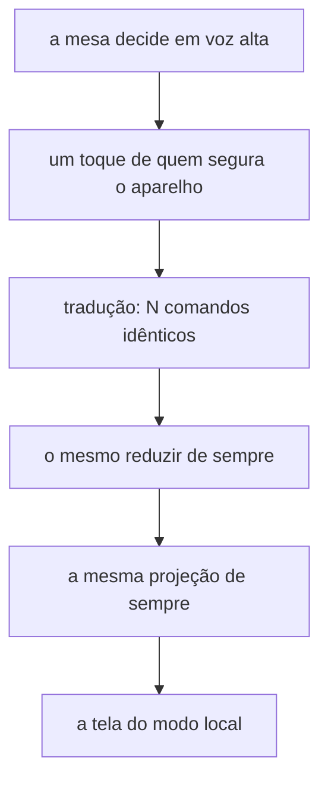

# Passa e Joga: ajustes de mesa — Design

## Architecture Overview

A decisão central desta rodada foi **verificada antes de ser escrita**, e ela é melhor do que o esperado: **nenhuma regra de jogo muda**.

O que parecia exigir uma segunda implementação — "tirar a votação do Dedo e do Espião" — na verdade é uma tradução de gesto. No modo online, cinco pessoas votando são cinco decisões independentes que o sistema precisa apurar. Numa mesa, a votação já aconteceu **em voz alta**, e o que chega ao aparelho é o resultado: uma decisão só. O modo local então despacha essa decisão como **N comandos idênticos**, um por jogador, e o reducer de sempre apura o que sempre apurou.

Isso foi provado contra o motor real antes de virar design:

| Prova | Resultado |
| --- | --- |
| Dedo: 4 jogadores apontam pro mesmo | `fase: apuracao`, `vencedor: {id: j2, votos: 4}`, `empatou: false` |
| Espião: 4 acusam quem não é o espião | `aMesaAcertou: false`, `desfecho: mesaPerdeu` |
| Espião: 4 acusam o espião de verdade | `desfecho: chuteDoEspiao`, com `chuteDoEspiao` já montado na projeção |

A tela de chute do local, que `PJ2-13` pede, **já existe** e já nasce da regra. Não há o que construir ali além de entregar o aparelho a quem chuta.

## Code Reuse Analysis

| O que já existe | Como esta rodada usa |
| --- | --- |
| `enviarComo(autorId, comando)` em `Partida.tsx` | É o canal por onde os N comandos idênticos saem. Já existia pros Enigmas. |
| `chuteDoEspiao` na projeção do Espião | `PJ2-13` inteiro. Nada novo. |
| `molduraDaSala(codigo)` em `tela.ts` | `PJ2-02`. Oito telas passam `codigo={sala.codigo}` cru; o Dedo e os Enigmas já usam o helper. É adotar o padrão que já venceu. |
| `PainelDaResenha` | O precedente: decisão de modo mora no componente, não repetida em cada tela. A contagem 3-2-1 segue o mesmo molde. |
| `voltaDaFase` / `donoDoAparelho` em `volta.ts` | Já puras e testadas. Todo fluxo novo de passagem entra aqui, não em `.tsx`. |
| `sortearAlvos` (ciclo único) | `PJ2-06` só precisa que o ciclo **não seja embaralhado**. |

## Components

### 1. `Config.paresDeEscrita` — a única mudança que toca `shared/`

`'sorteados' | 'roda'`, padrão **`'sorteados'`**. Em `'roda'`, `sortearAlvos` pula o embaralhamento e liga cada um ao seguinte na ordem recebida.

É a única forma honesta de atender `PJ2-06` sem que o modo local reescreva estado de jogo por fora. As alternativas foram descartadas:

- *Injetar um `aleatorio` que produz a permutação identidade* — funciona (Fisher-Yates com `r → 1` fixa `j = i`), mas é uma piada interna que o próximo leitor não decifra, e o mesmo `aleatorio` sorteia os pacotes.
- *O motor reescrever `estado.atribuicoes` depois de `iniciarRodada`* — o modo local editando estado interno de um jogo viola `AD-002` de frente.

O online nunca lê `'roda'`: o valor padrão preserva o comportamento de hoje byte a byte.

### 2. `Config.dedo.autoVoto` forçado a `true` no modo local

`DEDO-06` proíbe apontar pra si mesmo, e com razão: no online, apontar pra si é uma jogada. No local **não existe apontar pra si** — existe a mesa dizendo quem levou, e quem levou está incluído nessa conta. Sem isso, os N comandos idênticos param no próprio vencedor e a rodada nunca fecha.

O lobby local já esconde a config "Os dedos", então isso não vira escolha exposta a ninguém.

### 3. `volta.ts` — dois fluxos novos, um removido

- **Removido:** a volta da votação do Espião (`PJ-28` da rodada anterior). Some com `PJ2-11`.
- **Novo:** a volta do chute do espião — entrega o aparelho a quem chuta, e **só a ele**.
- **Novo:** a volta de escrita do Quem Sou Eu passa a carregar o que a tela seguinte mostra (a carta do vizinho), não só quem recebe.

### 4. `Contagem` — o 3-2-1 (`PJ2-18`, `PJ2-21`)

Componente próprio, pulável por toque. A decisão de pular mora nele, como no `PainelDaResenha`.

### 5. O lobby local (`PJ2-22`…`PJ2-25`)

Hoje `Mesa.tsx` monta a mesa e some. Ela passa a ser **destino de volta**: o fim de partida oferece "voltar ao lobby", os nomes continuam lá, e trocar de jogo reseta as regras sem tocar nos nomes.

## Riscos

| # | Risco | Mitigação |
| --- | --- | --- |
| 1 | O chute do espião reabre a volta de passagem, e o ramo do Espião em `TelaDoJogo` volta a mostrar `EspiaoPapel` — exatamente o bug relatado | O ramo passa a distinguir **qual** volta está aberta, não só *se* há uma. Teste em `volta.ts`. |
| 2 | `autoVoto: true` vazar pro online | Só é escrito na config que o motor local monta. Teste que o padrão do online segue `false`. |
| 3 | N comandos idênticos deixarem N eventos no histórico | Verificar o que `eventos` acumula; se poluir, o local filtra na projeção, nunca na regra. |
| 4 | `PJ2-05` bloquear o começo e a mesa não entender o porquê | O bloqueio diz o que falta na mesma tela, não no toque. |
| 5 | Voltar ao lobby com estado de partida velho pendurado | `novaPartida` já existe e zera; o lobby reusa esse caminho em vez de um segundo. |
| 6 | A contagem 3-2-1 atrasar mesa acostumada | Pulável por toque, decidido na spec. |

## Tech Decisions

**Por que N comandos idênticos, e não um comando novo `registrarResultado`.** Um comando novo seria uma segunda porta pro mesmo estado, com a sua própria apuração — e no dia em que o critério de desempate mudasse, mudaria num lugar só dos dois. `AD-008` proíbe projeção e regra divergirem; isto é a mesma doença um nível acima. A tradução acontece na borda, e o miolo continua com uma entrada só.

**Por que o placar continua no Espião (`PJ2-15`).** Foi escolha explícita do usuário entre as três opções oferecidas. O aparelho perde a urna, não a memória.
