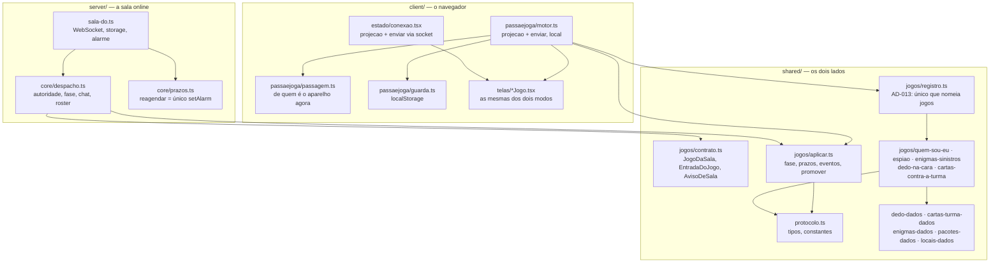

# Passa e Joga Design

> Spec: [spec.md](spec.md) — `PJ-01` a `PJ-35`.
> Decisões vigentes consultadas: `AD-002`, `AD-003`, `AD-005`, `AD-008`, `AD-009`, `AD-010`, `AD-011`, `AD-012`, `AD-013`, `AD-014`, `AD-015`.

## Architecture Overview

O modo não é um segundo produto: é **o mesmo motor rodando sem rede**.

A descoberta que define o desenho é que `server/games/**` não importa nada de `server/` — só de `shared/` e dos próprios irmãos. Os cinco jogos já são funções puras com relógio e sorteio injetados (`Ambiente`), exatamente o que `AD-009` exigiu. Morar em `server/` era convenção; deixa de ser.

Então os jogos mudam de casa para `shared/jogos/`, e o único pedaço de `core` que o navegador também precisa — aplicar um `ResultadoReducer` sobre a sala — é **extraído**, não copiado. Servidor e navegador passam a chamar a mesma `aplicar()`.

O que **não** atravessa: sala, host, roster, chat, reconexão, `setAlarm`. Numa festa não existe nenhum deles. O motor local é um despachante magro que troca um comando por uma projeção.



**Por que o motor local não chama `despachar()`.** Foi a alternativa considerada e recusada. `despachar()` acrescenta ao `reduzir` exatamente três coisas: permissão de host, guarda de fase e registro no chat. Nenhuma existe num aparelho só. Usá-lo obrigaria o modo local a inventar um `hostId`, um log de chat que ninguém lê e um roster com `situacao` — mock permanente, mantido para sempre por causa de uma assinatura. O que é regra de verdade mora em `reduzir`, e esse é o mesmo objeto nos dois modos, vindo do mesmo registro.

**O que o motor local compartilha, então:** `reduzir`, `iniciarRodada`, `projetar`, `aplicar` e o registro. É tudo que decide partida.

## Code Reuse Analysis

| O que existe | Como o Passa e Joga usa |
| --- | --- |
| `server/games/*/{regras,projecao,sorteio,index}.ts` | Movidos para `shared/jogos/`. Nenhuma linha de regra muda; a suíte atual (894 unit + 88 integration) é a rede que prova isso. |
| `server/core/despacho.ts::aplicar()` | Extraída para `shared/jogos/aplicar.ts`. `despacho.ts` passa a chamá-la; comportamento idêntico. |
| `JogoDaSala`, `EntradaDoJogo`, `AvisoDeSala` (hoje em `despacho.ts`) | Movidos para `shared/jogos/contrato.ts`. `despacho.ts` reexporta, para não tocar nos imports do servidor. |
| `server/games/registro.ts` | Vira `shared/jogos/registro.ts`. Continua sendo o **único** arquivo que nomeia jogos concretos (`AD-013`). |
| `shared/protocolo.ts` — `EstadoSala`, `ContextoDeSala`, `Projecao`, `Config`, `CONFIG_PADRAO` | Reusados como estão. `projetar` exige um `EstadoSala`, então o motor local guarda um — o que ele não faz é despachar através dele. |
| `server/core/prazos.ts` — `definir`, `vencidos`, `menorPrazo`, `TIPOS_DE_PRAZO` | As três primeiras são puras e o motor local precisa delas. Vão junto de `aplicar` para `shared/jogos/prazos.ts`; `reagendar` e `FOLGA_DO_ALARME_MS` ficam em `server/core/` — são do Durable Object (`AD-010`). |
| `client/src/estado/relogio.ts` — `restanteAte`, `formatarTempo` | Reusados sem mudança. Já são "instante absoluto menos agora", que é justamente o que `PJ-14` pede. |
| Telas de jogo (`DedoJogo`, `EspiaoJogo`, `EnigmasJogo`, `Jogo`, `*Encerrada`) | Recebem `{ projecao, enviar, aoSair }`. O motor local expõe **a mesma forma** que `useConexao()`, então elas rodam nos dois modos. As diferenças de layout entram por uma prop `modo`, não por telas paralelas. |
| `shared/jogos-catalogo.ts` | Ganha `passaEJoga?: boolean`. É de onde a lista do modo sai (`PJ-03`, `PJ-04`) — nenhuma tela cita jogo por nome. |
| `shared/jogos-conteudo.ts` + `scripts/paginas.ts` | Ganham a página indexável do modo (`PJ-05`), no mesmo mecanismo das páginas de jogo. |
| `client/src/componentes/*` (`Botao`, `Modal`, `ModalComoJogar`, `Carta`, `MarcadorDeJogador`, `cores.ts`) | Reusados. Nenhum componente novo de sistema. |
| `client/src/sons.ts` | Reusado — a tela de passagem tem som próprio, mas pela API que já existe. |

**O que é código novo de verdade:** o motor local, a fila de passagem, a guarda em `localStorage`, a porta de entrada e a tela da mesa. Cinco arquivos.

## Components

### 1. `shared/jogos/` (movimentação)

Move `server/games/*` inteiro, testes junto. `server/games/` deixa de existir.

- `shared/jogos/contrato.ts` — `AvisoDeSala`, `EntradaDoJogo`, `JogoDaSala<E>`. Só tipos.
- `shared/jogos/prazos.ts` — `TIPOS_DE_PRAZO`, `definir`, `vencidos`, `menorPrazo`.
- `shared/jogos/aplicar.ts` — a `aplicar()` de hoje, com uma diferença: em vez de escrever no chat, devolve os eventos a quem chamou.
- `shared/jogos/registro.ts` — `REGISTRO_DE_JOGOS`, idêntico ao de hoje com os caminhos novos.

`server/core/despacho.ts` encolhe: `paraOJogo` chama `aplicar()` de `shared/` e registra no chat os eventos devolvidos. `server/core/prazos.ts` mantém só `reagendar` e `FOLGA_DO_ALARME_MS`, reexportando o resto para não quebrar import nenhum.

> **`AD-002` continua valendo.** A fronteira é "o `core` não conhece jogo concreto", e ela não muda: o `core` continua recebendo o registro por injeção. O que muda é o CEP dos jogos. `AD-012` já estabeleceu que dado de jogo conhecido pelos dois lados mora em `shared/`; isto é a mesma regra aplicada à regra, agora que o navegador também a executa. Vira `AD-017`.

### 2. `client/src/passaejoga/motor.ts`

O coração. Puro, testável sem React.

```ts
interface MesaLocal {
  versao: number
  jogoId: string
  /** Na ordem da roda (`PJ-07`). É a ordem de passagem. */
  jogadores: Jogador[]
  sala: EstadoSala
  /** De quem é o aparelho agora. Decide para quem projetar (`PJ-16`). */
  aparelhoCom: JogadorId
  passagem: Passagem | null
  eventos: EventoDeJogo[]
}

function iniciar(jogoId, nomes, config, ambiente): Resultado<MesaLocal>
function enviar(mesa: MesaLocal, comando: ComandoDeJogo, ambiente): Resultado<MesaLocal>
function projetar(mesa: MesaLocal): Projecao
function cobrarPrazos(mesa: MesaLocal, agora: number): MesaLocal
```

- `enviar` monta o `ContextoDeSala` com `autorId = mesa.aparelhoCom`, chama `reduzir` do módulo vindo do registro e aplica com `aplicar()`. Recusa devolve a mesa **intacta** mais o código de erro (`PJ-13`).
- `projetar` chama `jogo.projetar(sala.jogo, sala, mesa.aparelhoCom)`. É como `PJ-16` sai de graça: quem está com o aparelho vê a projeção dele e só ela, pela mesma função do servidor (`AD-008`).
- `cobrarPrazos` compara `vencidos(sala, agora)` com o relógio e despacha `{ t: 'venceuPrazoTurno' }`. Chamada no tick de 1s **e** no `visibilitychange` — nunca por `setTimeout` de longa duração (`PJ-14`). É idempotente porque o próprio reducer redefine o prazo ao consumi-lo.
- Sem host: comandos que exigiriam autoridade (`encerrar`, `novaPartida`, `proximaCarta`) são de quem está com o aparelho, e no modo local isso é a mesa inteira.

### 3. `client/src/passaejoga/passagem.ts`

A fila de segredo, pura. Um `Passagem` é `{ fila: JogadorId[]; posicao: number; revelado: boolean }`.

Três estados de tela, e nunca dois ao mesmo tempo:

1. **anúncio** — "Passe pro Bruno", nada do conteúdo montado (`PJ-17`);
2. **revelado** — o conteúdo, com um único caminho adiante (`PJ-18`);
3. avança `posicao` e volta a (1), sem quadro intermediário (`PJ-19`).

`revelado` **nunca** é persistido: ao recarregar, a fila volta ao anúncio daquele jogador (`PJ-20`). Isso é uma linha na serialização, e é o requisito inteiro.

A ordem da fila é a ordem dos nomes (`PJ-07`), então o aparelho anda de vizinho pra vizinho. Nas fases sem segredo, `passagem === null` e a tela é uma só (`PJ-21`).

### 4. `client/src/passaejoga/guarda.ts`

`localStorage`, chave `resenha.passaejoga`. Grava a cada mudança de mesa, lê na montagem. `versao` decide compatibilidade: número diferente, descarta em silêncio e volta à porta. JSON quebrado ou storage indisponível, idem — uma partida perdida é ruim, um app que não abre é pior (`PJ-32`).

### 5. Telas

| Tela | Requisitos |
| --- | --- |
| `Inicio.tsx` (mexida) | `PJ-01`, `PJ-02` — segunda ação abaixo de "Criar uma sala", com `(?)` no padrão do `ModalComoJogar`. |
| `passaejoga/Porta.tsx` | `PJ-03`, `PJ-04` — a lista vem do catálogo filtrada por `passaEJoga`, e diz em uma linha por que Cartas não está ali. |
| `passaejoga/Mesa.tsx` | `PJ-06`–`PJ-10` — "Quem vai jogar?", com o aviso da ordem da roda; validação de mínimo, repetido e vazio; as configurações daquele jogo, sem as de coordenação. |
| `passaejoga/Passagem.tsx` | `PJ-17`–`PJ-21` — a tela única de passagem, igual nos quatro jogos. |
| Telas de jogo existentes | `PJ-22`–`PJ-31`, via prop `modo: 'sala' | 'local'`. |

### 6. As adaptações de cada jogo

Nenhuma delas mexe em regra. Todas são a fila de passagem chamada em fase diferente.

**Dedo na Cara** (`PJ-22`) — sem passagem. Aparelho na mesa, carta em letra grande, e o toque registra quem levou. `config.dedo.votacao` some da tela: num aparelho só, voto é sempre aberto.

**Enigmas Sinistros** (`PJ-23`, `PJ-24`) — o aparelho fica com quem narra. Trocar de narrador é uma passagem de um item só. `config.enigmas.modoPergunta` é fixo em `voz` — a fila de perguntas presume aparelhos separados.

**Espião** (`PJ-25`–`PJ-28`) — a volta de revelação é a fila de passagem sobre a projeção de cada jogador, que já traz o papel. Cada "esconder e passar" emite o `marcarPronto` daquele jogador. **O último `marcarPronto` fica retido**: a tela de "todos prontos?" é o que o dispara, e é aí que `rodadaIniciada` vira `true` e o relógio começa (`PJ-26`). Sem isso o relógio começaria enquanto o aparelho ainda estivesse dando a volta — e não é preciso mudar uma linha de `regras.ts` para evitar. Começado o relógio, o aparelho fica **parado na mesa** e as perguntas correm em voz alta entre quaisquer dois jogadores, perto ou longe (`PJ-27`). A votação usa a fila de novo (`PJ-28`).

**Quem Sou Eu?** (`PJ-29`, `PJ-30`) — a fila entrega o aparelho a cada um para escrever a carta de quem o sorteio designou. Na vez de alguém, a projeção daquele jogador já esconde a carta dele; a tela só aumenta a fonte e vira o aparelho pra mesa.

### 7. Página indexável (`PJ-05`)

`shared/jogos-conteudo.ts` ganha `CONTEUDO_DO_PASSA_E_JOGA`, com a mesma forma de `ConteudoDoJogo` menos o `jogoId`. `scripts/paginas.ts` emite `passa-e-joga.html` e a entrada no `sitemap.xml`. A página leva ao app por `/?modo=passa-e-joga`, no mesmo padrão de `/?jogo=espiao` que `jogoDaUrl` já lê — o slug não pode ser rota do SPA porque a Cloudflare serve arquivo antes de chamar o Worker.

## Data Models

```ts
/** `shared/jogos/aplicar.ts` — o que o servidor e o navegador fazem igual. */
export function aplicar<E>(
  sala: EstadoSala<E>,
  resultado: Extract<ResultadoReducer<E>, { ok: true }>,
): EventoDeJogo[]

/** `client/src/passaejoga/motor.ts` */
export interface MesaLocal { /* ver Componente 2 */ }
export interface Passagem {
  fila: JogadorId[]
  posicao: number
  /** Nunca persistido (`PJ-20`). */
  revelado: boolean
}
```

`EstadoSala` é reusado inteiro, com os campos que o modo não usa preenchidos de forma honesta e imutável: `codigo: ''`, `hostId` = o primeiro da roda (o contrato exige um; nenhuma tela local o consulta), `banidos: []`, `chat: []`, `limiteJogadores` = o tamanho da mesa. `config` sai de `CONFIG_PADRAO` com os campos de coordenação fixados: `ordemTurnos: 'entrada'` (a ordem da roda), `enigmas.modoPergunta: 'voz'`, `espiao.visibilidadeVoto: 'oculta'`.

## Error Handling Strategy

| Situação | Comportamento |
| --- | --- |
| `reduzir` recusa o comando | Mesa intacta, código de erro vira frase na tela, partida segue (`PJ-13`). |
| `iniciarRodada` recusa (poucos jogadores, pacote vazio) | Não sai da tela da mesa; o botão diz o que falta, como `motivoParaIniciar` já faz (`PJ-08`, `PJ-31`). |
| `localStorage` indisponível ou JSON quebrado | Descarta e abre na porta. O modo funciona sem persistência; só perde `PJ-29`. |
| `versao` diferente | Idem, em silêncio. |
| Jogo do `localStorage` não está mais no registro | Descarta e abre na porta — mesmo cenário do Edge Case 4 do `core`. |
| Recarregar com segredo à vista | Reabre no anúncio da passagem, nunca no conteúdo (`PJ-20`). |
| Sair do modo com partida em andamento | Confirmação antes de descartar (`PJ-35`). |

## Risks & Concerns

| Risco | Impacto | Mitigação |
| --- | --- | --- |
| **Bundle.** Cinco jogos e todo o conteúdo (cartas, enigmas, locais) entrando no bundle principal deixa a tela inicial mais lenta para quem só quer criar sala. | Alto | A rota do Passa e Joga entra por `import()` dinâmico. Medir o `dist/` antes e depois; se o principal crescer, o corte é aqui. |
| **A movimentação quebrar import silenciosamente.** Mais de 20 arquivos mudam de caminho. | Médio | É movimentação pura, sem edição de lógica. `typecheck` e as duas suítes rodam antes de qualquer código novo, numa task só e num commit só. |
| **`aplicar()` divergir do original ao ser extraída.** Ela hoje escreve no chat; a versão compartilhada devolve eventos. | Alto | A mudança de assinatura é mecânica, e `despacho.test.ts` (1166 linhas) mais os testes de integração cobrem o caminho do servidor. A extração vai numa task própria, antes de o motor local existir. |
| **Relógio em aba dormindo.** `setTimeout` não é confiável em segundo plano; um jogo que conta em vez de derivar erra o tempo. | Alto | `cobrarPrazos` compara instantes absolutos, no tick e no `visibilitychange`. Nenhum `setTimeout` maior que 1s no motor. |
| **Vazamento de segredo num quadro.** Um `useEffect` que revela antes de o React pintar o anúncio entrega o papel do Espião à mesa errada. | Alto | `revelado` é estado do motor, não do React, e a transição do item N para o N+1 zera `revelado` **no mesmo despacho**. Teste dedicado ao invariante "nunca `revelado` com `posicao` recém-avançada". |
| **Telas compartilhadas encherem de `if (modo === 'local')`.** | Médio | Se uma tela passar de dois ramos, ela se parte em duas. Fica registrado aqui como o gatilho, para não virar julgamento no meio do arquivo. |
| **`hostId` de mentira encostar em alguma regra.** Alguns reducers consultam `ctx.hostId`. | Médio | No modo local o `hostId` é o primeiro da roda e nunca muda — comandos de host são de quem está com o aparelho, que é a mesa. Cobrir com teste os quatro jogos iniciando e encerrando localmente. |
| **Espião: o `marcarPronto` retido.** É a única sutileza de fluxo que não está no reducer. | Médio | Vive no motor, com nome explícito e teste próprio: a volta de revelação **não** pode ligar o relógio; só a tela de "começar" liga. |

## Tech Decisions

| Decisão | Alternativa recusada | Por quê |
| --- | --- | --- |
| Motor local com despachante próprio, compartilhando `reduzir` e `aplicar` | Reusar `despachar()` inteiro | O modo local não tem host, chat nem roster. Reusar obrigaria a fabricar os três para sempre. |
| Jogos em `shared/jogos/` | Cliente importar de `server/games/` | Funciona hoje, e quebra no dia em que um jogo importar algo de Cloudflare. A fronteira precisa ser física. |
| `aplicar()` devolve eventos em vez de escrever no chat | Passar o chat como dependência | Chat é da sala. Devolver eventos deixa a função pura e serve aos dois lados sem inventar um chat local. |
| Uma tela de passagem para os quatro jogos | Cada jogo com a sua | Um gesto só pra mesa aprender. Gesto errado custa o segredo justamente no momento em que ele importa. |
| `EstadoSala` reusado no motor local | Um estado local próprio, menor | `projetar` exige `EstadoSala`. Um tipo paralelo obrigaria a converter em toda projeção. |
| Persistência em `localStorage` com `versao` | `IndexedDB` | A mesa inteira tem poucos KB e é sempre lida inteira — o mesmo raciocínio de `AD-005`. |
| Página indexável como arquivo mais `/?modo=` | Rota do SPA em `/passa-e-joga` | A Cloudflare serve arquivo antes do Worker; é o padrão que as páginas de jogo já usam. |

## Requirements Coverage

| Bloco | Requisitos | Onde |
| --- | --- | --- |
| P1 | `PJ-01`–`PJ-05` | `Inicio.tsx`, `passaejoga/Porta.tsx`, catálogo, `scripts/paginas.ts` |
| P2 | `PJ-06`–`PJ-10` | `passaejoga/Mesa.tsx`, `motor.iniciar` |
| P3 | `PJ-11`–`PJ-16` | `shared/jogos/`, `shared/jogos/aplicar.ts`, `motor.ts` |
| P4 | `PJ-17`–`PJ-21` | `passagem.ts`, `passaejoga/Passagem.tsx`, `guarda.ts` |
| P5 | `PJ-22`–`PJ-31` | telas de jogo com `modo`, `motor.ts` (o pronto retido do Espião) |
| P6 | `PJ-32`–`PJ-35` | `guarda.ts`, `Porta.tsx`, `motor.ts` |
