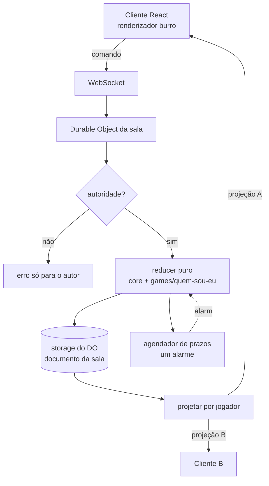

# Quem Sou Eu? — Design

**Spec**: `.specs/features/quem-sou-eu/spec.md`
**Context**: `.specs/features/quem-sou-eu/context.md`
**Status**: Draft

---

## Architecture Overview

Uma sala = um Durable Object. Todo comando de jogador chega por WebSocket, é validado quanto à autoridade, passa por um **reducer puro**, é persistido no storage do DO, e o servidor **projeta um objeto diferente para cada jogador conectado** e envia. O cliente não contém nenhuma regra de jogo — ele desenha a projeção que recebeu.

Essa escolha é o que torna o `JOGO-02` (a carta do jogador nunca trafega para ele) uma propriedade **estrutural**: existe uma única função que serializa cartas e ela recebe "para quem". A carta do próprio jogador não é filtrada do payload — ela nunca é construída nele.



### Fronteira `core` / `games` (AD-002)

| Camada | Responsabilidade | Nunca faz |
| ------ | ---------------- | --------- |
| `core` | Sala, código, roster, apelidos, cores, tokens, host e migração, expulsão, chat, agendador de prazos, transporte WebSocket, persistência, despacho de comandos | Conhecer cartas, alvos, turnos ou qualquer regra de "Quem Sou Eu?" |
| `games/quem-sou-eu` | Sorteio de alvos, cartas, PRONTO, ordem e avanço de turnos, "Descobri!", revelação | Tocar em socket, storage, alarme ou roster |

O contrato entre elas é **uma interface com três funções puras**, um único implementador. Não é um framework de jogos — é a fronteira mínima que permite `games/espiao/` existir depois sem reescrever `core`.

```typescript
interface ModuloDeJogo<E, C> {
  iniciarRodada(jogadores: Jogador[], config: Config, agora: number): E
  reduzir(estado: E, ctx: ContextoDeSala, comando: C, agora: number): ResultadoReducer<E>
  projetar(estado: E, sala: EstadoSala, paraJogador: JogadorId): unknown
}
```

`ResultadoReducer` devolve `{ estado, eventos, prazos, faseSeguinte? }` — o `core` aplica; o jogo nunca executa efeito.

---

## Code Reuse Analysis

Projeto greenfield — não há código anterior a reaproveitar. O que se reaproveita são padrões e plataforma:

| Recurso | Origem | Como usar |
| ------- | ------ | --------- |
| WebSocket Hibernation API | Plataforma Cloudflare | `ctx.acceptWebSocket()` + handlers `webSocketMessage/Close/Error` em vez de `addEventListener` |
| `serializeAttachment` / `deserializeAttachment` | Plataforma Cloudflare | Vínculo socket → `jogadorId`, única coisa que precisa sobreviver à hibernação fora do storage |
| Alarms API | Plataforma Cloudflare | Base do agendador de prazos |
| Vite plugin da Cloudflare + static assets | Plataforma Cloudflare | Front e Worker num único `wrangler deploy`, com `not_found_handling: "single-page-application"` |
| Tipos do protocolo | Este projeto | Um único arquivo `protocolo.ts` importado por cliente e servidor — a fonte de verdade do contrato |

### Integration Points

| Sistema | Método de integração |
| ------- | -------------------- |
| Roteamento de sala | `env.SALA.idFromName(codigo)` — o código da sala é a identidade do Durable Object |
| Front → API | `POST /api/salas` (criar) e `GET /api/salas/:codigo/ws` (upgrade) |
| Front estático | Servido pelo mesmo Worker via binding de assets |

---

## Components

### `SalaDurableObject`

- **Purpose**: A casca da sala — recebe conexões, roteia comandos, persiste, difunde projeções e processa alarmes.
- **Location**: `server/core/sala-do.ts`
- **Interfaces**:
  - `fetch(req: Request): Response` — upgrade WebSocket e criação da sala
  - `webSocketMessage(ws: WebSocket, msg: string): void` — despacha comando
  - `webSocketClose(ws: WebSocket): void` — marca desconectado, agenda migração de host se for o host
  - `alarm(): void` — processa prazos vencidos e reagenda
- **Dependencies**: `estado`, `despacho`, `prazos`, `conexoes`
- **Reuses**: Hibernation API, Alarms API

### `estado`

- **Purpose**: Carregar e salvar o documento da sala; é o único ponto que toca o storage.
- **Location**: `server/core/estado.ts`
- **Interfaces**:
  - `carregar(storage): Promise<EstadoSala | null>` — `null` quando a sala não existe (`SALA-06`)
  - `salvar(storage, estado): Promise<void>`
  - `destruir(storage): Promise<void>` — `deleteAll()`, devolve o DO ao estado não-inicializado (`CONN-07`, `CONN-08`)
- **Dependencies**: nenhuma
- **Reuses**: storage SQLite do DO

### `conexoes`

- **Purpose**: Traduzir entre sockets vivos e `jogadorId`, sobrevivendo à hibernação.
- **Location**: `server/core/conexoes.ts`
- **Interfaces**:
  - `vincular(ws, jogadorId): void` — grava via `serializeAttachment`
  - `jogadorDe(ws): JogadorId | null` — lê via `deserializeAttachment`
  - `socketsDe(ctx, jogadorId): WebSocket[]`
  - `difundir(ctx, estado, projetar): void` — uma projeção por socket conectado
- **Dependencies**: `ctx.getWebSockets()`
- **Reuses**: `serializeAttachment` — necessário porque o construtor do DO roda de novo após hibernar e qualquer mapa em memória some

### `roster`

- **Purpose**: Regras de quem está na sala — entrada, apelido, cor, situação, host.
- **Location**: `server/core/roster.ts`
- **Interfaces**:
  - `entrar(estado, apelido, token, agora): Resultado<Jogador>` — valida `SALA-03`, `SALA-04`, `SALA-05`, aplica `SALA-09`/`SALA-10`
  - `reconectar(estado, tokenHash): Jogador | null` — `CONN-02`, recusa banido (`CONN-04`)
  - `expulsar(estado, alvoId): Resultado<void>` — `HOST-02`, registra o hash do token na lista de banidos
  - `transferirHost(estado, novoHostId): void` — `HOST-03`
  - `migrarHost(estado): JogadorId | null` — `HOST-04`, escolhe o conectado há mais tempo
  - `corLivre(estado): Cor` — `SALA-07`
- **Dependencies**: nenhuma (funções puras sobre o documento)
- **Reuses**: —

### `prazos`

- **Purpose**: Multiplexar quatro prazos independentes sobre o **único** alarme que um Durable Object admite.
- **Location**: `server/core/prazos.ts`
- **Interfaces**:
  - `definir(estado, tipo, quando: number | null): void`
  - `vencidos(estado, agora): TipoPrazo[]`
  - `reagendar(storage, estado): Promise<void>` — `setAlarm(menor prazo pendente)`
- **Dependencies**: Alarms API
- **Reuses**: —
- **Nota**: sem esse componente, agendar o timer de turno cancelaria silenciosamente o prazo de expiração da sala — `setAlarm()` só preserva a chamada mais recente.

### `despacho`

- **Purpose**: Validar autoridade, rotear o comando para `core` ou para o módulo de jogo, aplicar o resultado.
- **Location**: `server/core/despacho.ts`
- **Interfaces**:
  - `despachar(estado, jogadorId, comando, agora): Resultado<Efeitos>`
- **Dependencies**: `roster`, `chat`, `prazos`, `ModuloDeJogo`
- **Reuses**: —
- **Nota**: é o único lugar que decide "esse jogador pode fazer isso?" — `HOST-06`, `JOGO-06` e a rejeição de ações de jogador aguardando vivem aqui, não espalhadas.

### `chat`

- **Purpose**: Mensagens de jogador e de sistema, com limite de taxa e retenção.
- **Location**: `server/core/chat.ts`
- **Interfaces**:
  - `enviar(estado, jogadorId, texto, agora): Resultado<void>` — `CHAT-01`, `CHAT-02`
  - `registrarSistema(estado, evento, agora): void` — `CHAT-03`
- **Dependencies**: nenhuma
- **Reuses**: —

### `games/quem-sou-eu/regras`

- **Purpose**: O jogo inteiro, como funções puras.
- **Location**: `server/games/quem-sou-eu/regras.ts`
- **Interfaces**: implementa `ModuloDeJogo<EstadoQuemSouEu, ComandoQuemSouEu>`
- **Dependencies**: `sorteio`
- **Reuses**: —
- **Cobre**: `ESCR-01`…`ESCR-10`, `JOGO-03`…`JOGO-11`, `DESC-01`…`DESC-09`, `FIM-02`, `FIM-03`

### `games/quem-sou-eu/sorteio`

- **Purpose**: Permutação sem ponto fixo (derangement) — ninguém escreve para si.
- **Location**: `server/games/quem-sou-eu/sorteio.ts`
- **Interfaces**:
  - `sortearAlvos(ids: JogadorId[]): Record<JogadorId, JogadorId>`
- **Nota**: implementado como **ciclo aleatório único** (embaralha e liga cada um ao seguinte, fechando o círculo). Um ciclo de tamanho ≥2 nunca tem ponto fixo por construção — não há tentativa-e-erro nem possibilidade de falhar, o que atende ao edge case do spec para 3 jogadores.

### `games/quem-sou-eu/projecao`

- **Purpose**: Construir o que **um** jogador pode ver. É o guardião do `JOGO-02`.
- **Location**: `server/games/quem-sou-eu/projecao.ts`
- **Interfaces**:
  - `projetar(jogo, sala, paraJogador): ProjecaoJogo`
- **Regra invariante**: a carta de um jogador entra no payload dele **apenas** se `descobriram.includes(id)` ou `reveladoParaTodos`. Fora isso o campo não existe no objeto — não é `null`, não é máscara, é ausência.

### Cliente — `Conexao`

- **Purpose**: Único socket da aplicação; envia comandos, recebe projeções.
- **Location**: `client/src/estado/conexao.ts`
- **Interfaces**:
  - `useProjecao(): Projecao | null`
  - `enviar(comando: Comando): void`
- **Dependencies**: `protocolo`
- **Nota**: reconecta com backoff exponencial e reenvia `ola{token}`. O token vem do `localStorage`, chaveado por código de sala.

### Cliente — telas

- **Location**: `client/src/telas/{Inicio,Lobby,Escrita,Jogo,Encerrada}.tsx`
- **Nota**: a tela exibida deriva de `projecao.sala.fase` — não há rota nem estado de navegação próprio. Isso elimina a classe inteira de bugs "cliente e servidor discordam sobre a fase".

---

## Data Models

### Documento da sala (storage do DO)

```typescript
type Fase = 'lobby' | 'escrita' | 'jogo' | 'encerrada'
type JogadorId = string           // curto, público
type Situacao = 'ativo' | 'aguardando'

interface EstadoSala {
  codigo: string
  fase: Fase
  hostId: JogadorId
  jogadores: Jogador[]            // em ordem de entrada
  banidos: string[]               // hashes de token expulsos (HOST-02)
  config: Config
  chat: MensagemChat[]            // ring buffer, máx. 200 (CHAT-05)
  jogo: EstadoQuemSouEu | null
  prazos: Prazos
  ultimaAcaoEm: number
}

interface Jogador {
  id: JogadorId
  tokenHash: string               // guarda-se o hash, nunca o token
  apelido: string
  cor: Cor
  entrouEm: number
  conectado: boolean
  desconectadoEm: number | null
  situacao: Situacao
}

interface Config {
  ordemTurnos: 'sorteada' | 'entrada'   // CFG-01
  aoDescobrir: 'continua' | 'sai'       // CFG-02
  tempoTurnoSeg: number | null          // CFG-03, null = sem limite
}

interface Prazos {
  turno: number | null            // JOGO-07
  migracaoHost: number | null     // HOST-04
  salaVazia: number | null        // CONN-07
  salaOciosa: number              // CONN-08
}
```

### Estado do jogo

```typescript
interface EstadoQuemSouEu {
  atribuicoes: Record<JogadorId, JogadorId>   // escritor → alvo
  cartas: Record<JogadorId, Carta>            // DONO da carta → carta
  prontos: JogadorId[]
  ordem: JogadorId[]
  vezDe: JogadorId | null
  descobriram: JogadorId[]
  declaracaoPendente: Declaracao | null
  reveladoParaTodos: boolean
  notas: Record<JogadorId, string>            // privado por jogador (NOTA-02)
}

interface Carta { texto: string; escritaPor: JogadorId }
interface Declaracao { jogadorId: JogadorId; confirmadorId: JogadorId; declaradaEm: number }
```

**Por que `cartas` é chaveado pelo dono e não pelo escritor**: a projeção precisa perguntar "qual é a carta DESTE jogador?" a cada serialização. Chavear pelo escritor obrigaria uma busca reversa em todo envio — exatamente o ponto onde um engano vaza a carta errada. Chaveado pelo dono, a checagem do `JOGO-02` é uma comparação de chave.

**Não existe caminho de vazamento pelo campo do escritor**: como o sorteio é uma permutação sem ponto fixo, o alvo de um jogador nunca é ele mesmo, então enviar "a carta que você escreveu" jamais revela a própria.

### Protocolo

```typescript
// cliente → servidor
type Comando =
  | { t: 'ola'; token: string }
  | { t: 'entrar'; apelido: string }
  | { t: 'configurar'; config: Partial<Config> }        // host
  | { t: 'iniciar' } | { t: 'cancelar' } | { t: 'comecar' }   // host
  | { t: 'escreverCarta'; texto: string }
  | { t: 'marcarPronto'; pronto: boolean }
  | { t: 'passarVez' } | { t: 'pularVez' }
  | { t: 'declararDescobri' }
  | { t: 'responderDeclaracao'; aceita: boolean }
  | { t: 'encerrar' } | { t: 'novaPartida' }             // host
  | { t: 'expulsar'; jogadorId: JogadorId }              // host
  | { t: 'transferirHost'; jogadorId: JogadorId }        // host
  | { t: 'chat'; texto: string }
  | { t: 'notas'; texto: string }
  | { t: 'sair' }

// servidor → cliente
type Mensagem =
  | { t: 'projecao'; dados: Projecao }
  | { t: 'entrou'; token: string; jogadorId: JogadorId }
  | { t: 'erro'; codigo: CodigoErro; mensagem: string }   // só para o socket autor
```

### Projeção (o que UM jogador vê)

```typescript
interface Projecao {
  sala: { codigo: string; fase: Fase; hostId: JogadorId; config: Config }
  eu: {
    id: JogadorId
    ehHost: boolean
    situacao: Situacao
    souConfirmador: boolean                 // DESC-02, DESC-03
    alvo?: { id: JogadorId; apelido: string }   // ESCR-02
    cartaQueEscrevi?: string
    pronto: boolean
    notas: string
    minhaCarta?: string                     // presente APENAS após DESC-04 ou FIM-02
  }
  jogadores: Array<{
    id: JogadorId; apelido: string; cor: Cor
    conectado: boolean; situacao: Situacao
    descobriu: boolean; pronto: boolean
    carta?: string                          // ausente quando id === eu.id e não revelada
  }>
  jogo?: {
    vezDe: JogadorId | null
    ordem: JogadorId[]
    prazoTurno: number | null               // timestamp absoluto, não segundos restantes
    prontos: number; total: number          // ESCR-04
    declaracaoPendente?: { jogadorId: JogadorId }
  }
  chat: MensagemChat[]
}
```

**`prazoTurno` é um timestamp absoluto**, não uma contagem regressiva. O cliente calcula os segundos restantes localmente. Enviar "faltam 23s" exigiria reenviar a projeção a cada segundo para 20 jogadores; enviar o instante do vencimento custa um envio só e sobrevive à hibernação do DO.

---

## Error Handling Strategy

| Cenário | Tratamento | Impacto para o usuário |
| ------- | ---------- | ---------------------- |
| Apelido inválido ou repetido (`SALA-03`, `SALA-04`) | `erro` só para o socket autor, entrada recusada | Mensagem no formulário, permanece na tela de entrada |
| Sala cheia ou inexistente (`SALA-05`, `SALA-06`) | `erro` e socket fechado | Tela de entrada com o motivo e a opção de criar sala |
| Comando sem autoridade (`HOST-06`, `JOGO-06`) | Rejeitado no `despacho`, estado intocado, `erro` ao autor | Nada muda; na prática o botão nem é exibido (`VIS-04`) |
| Comando inválido para a fase atual | Mesma rejeição — a fase é sempre revalidada no servidor | Nada muda |
| Token banido (`CONN-04`) | Conexão recusada no handshake | "Você foi removido desta sala" |
| Queda de socket | `webSocketClose` marca desconectado e difunde; vaga preservada (`CONN-03`) | Aparece como desconectado para os outros; reconecta sozinho |
| DO hibernado ou reiniciado | Estado recarregado do storage no construtor (`CONN-05`) | Invisível |
| Mensagem malformada / JSON inválido | Descartada com log; socket permanece aberto | Nada acontece |
| Flood de chat (`CHAT-02`) | Excedentes descartadas, aviso só ao autor | Só o autor vê o aviso |
| Sala expirada (`CONN-07`, `CONN-08`) | `deleteAll()` e sockets fechados | "Esta sala expirou", volta ao início |

---

## Risks & Concerns

| Concern | Location | Impact | Mitigation |
| ------- | -------- | ------ | ---------- |
| **Tipo de storage do DO é imutável** — criar o namespace com `new_classes` em vez de `new_sqlite_classes` é irreversível e o plano free só admite SQLite | `wrangler.jsonc` (migração inicial) | Namespace inutilizável no free tier; exige recriar com outro nome de classe | Task dedicada e isolada para a migração inicial, antes de qualquer código de sala, com verificação explícita do valor no arquivo |
| **Hibernação apaga estado em memória** — o construtor roda de novo | `server/core/sala-do.ts` | Sala "some" no meio do jogo | AD-005 (storage a cada mutação) + `serializeAttachment` para o vínculo socket→jogador. Nenhum campo mutável de sala pode viver em campo de instância |
| **Um único alarme por DO** — `setAlarm()` só preserva a chamada mais recente | `server/core/prazos.ts` | Agendar o turno cancelaria a expiração da sala, silenciosamente | Componente `prazos` é o único autorizado a chamar `setAlarm()`; sempre reagenda para o menor prazo pendente |
| **Vazamento da própria carta** — o requisito mais crítico do produto | `server/games/quem-sou-eu/projecao.ts` | Quebra o jogo inteiro, de forma invisível na interface | Uma única função serializa cartas; teste que percorre a projeção de cada jogador e falha se o texto da carta dele aparecer em qualquer lugar do payload |
| **Difusão O(n) por evento** com até 20 jogadores | `server/core/conexoes.ts` | CPU por evento cresce linearmente | Aceito: sala de 20 gera projeções de poucos KB. Se virar problema, memoiza a parte comum e monta só o trecho por jogador |
| **Timer de turno com o DO hibernado** | `server/core/prazos.ts` | Turno não avançaria sozinho | O alarme acorda o DO — é justamente o mecanismo previsto para isso. O cliente nunca decide o avanço; ele só renderiza a contagem |
| **Acoplamento à Cloudflare** | Todo o servidor | Migrar de plataforma exigiria reescrever transporte e persistência | Aceito conscientemente (AD-004). Mitigação parcial: reducers e projeção são puros e não importam nada da plataforma — o que migraria é só a casca |
| **Cobertura de testes** | — | Projeto greenfield, sem código legado a herdar | Reducer e projeção puros permitem cobrir todos os ACs sem rede nem plataforma; só a casca do DO precisa de teste de integração |

---

## Tech Decisions

| Decision | Choice | Rationale |
| -------- | ------ | --------- |
| Estrutura do documento da sala | Documento único em vez de tabelas SQL | A sala tem <100KB e é sempre lida inteira; schema normalizado seria custo de migração sem ganho |
| Identidade do Durable Object | `idFromName(codigo)` | O código da sala já é uma chave natural, evita um índice de códigos→ids |
| Existência da sala | `carregar()` devolve `null` quando o storage está vazio | `idFromName` sempre devolve um objeto; a inicialização explícita via `POST /api/salas` é o que distingue sala viva de código inexistente (`SALA-06`) |
| Credencial de sessão | Guarda-se `tokenHash`, nunca o token | O documento da sala não deve conter credencial reutilizável |
| Contagem regressiva | Timestamp absoluto na projeção | Evita reenviar estado a cada segundo para cada jogador |
| Tela exibida no cliente | Derivada de `projecao.sala.fase` | Elimina divergência de fase entre cliente e servidor |
| Sorteio de alvos | Ciclo aleatório único | Sem ponto fixo por construção, sem retry, sem caso de falha |

> Três decisões acima são de nível de projeto e foram registradas em `.specs/STATE.md` como AD-008, AD-009 e AD-010.
