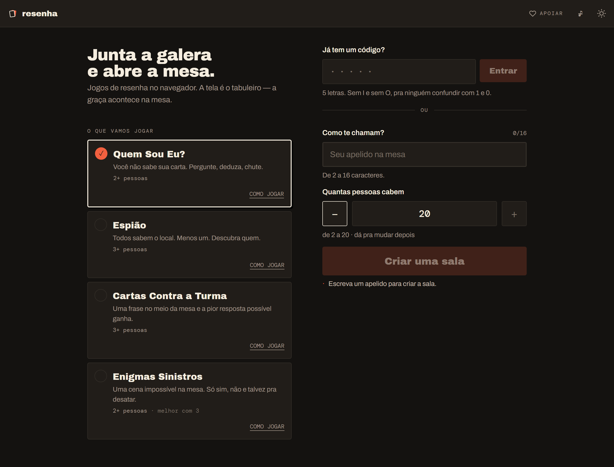

# Resenha

**Um hub de party games que roda no navegador.** Sem instalar nada, sem cadastro: você cria uma sala, manda um código de 5 letras no grupo e a galera entra.

🌐 **Jogue agora em [resenha.dev.br](https://resenha.dev.br/)**

[](https://www.gnu.org/licenses/gpl-3.0)



## Os jogos

| Jogo | O que é | Pessoas |
| --- | --- | --- |
| [Quem Sou Eu?](https://resenha.dev.br/quem-sou-eu) | Você não vê a própria carta. Pergunte, deduza, chute. | 2+ |
| [Espião](https://resenha.dev.br/espiao) | Todos sabem o local. Menos um. Descubra quem. | 3+ |
| [Cartas Contra a Turma](https://resenha.dev.br/cartas-contra-a-turma) | Uma frase no meio da mesa e a pior resposta possível ganha. | 3+ |
| [Enigmas Sinistros](https://resenha.dev.br/enigmas-sinistros) | Uma cena impossível. Só sim, não e talvez pra desatar. | 2+ |

Cada sala aguenta até 20 pessoas. Funciona com a turma junta no sofá, cada um com o celular na mão, e funciona igual com todo mundo em chamada de vídeo.

## Como foi feito

Um **Cloudflare Worker** serve o app e faz a ponte para os **Durable Objects** — um por sala, que é o dono de toda a verdade do jogo. O cliente não decide nada: manda comando, recebe projeção. Isso torna trapaça um problema de servidor, não de confiança no navegador, e faz a reconexão ser trivial — quem cai volta e recebe o estado inteiro.

Os WebSockets usam a **Hibernation API**: uma sala parada não consome tempo de CPU, mas continua existindo. É o que permite manter salas abertas de graça enquanto a mesa vai buscar cerveja.

```
client/   React 19 + Vite + Tailwind v4
server/
  core/     sala, roster, chat, prazos — não conhece jogo nenhum
  games/    cada jogo é um módulo com regras e projeção próprias
shared/   protocolo e conteúdo que os dois lados leem
```

A regra que segura a arquitetura: **`core/` nunca importa de `games/`**. Um jogo novo é uma pasta em `games/` mais uma linha no registro — nada no núcleo muda. Foi assim que o segundo, o terceiro e o quarto jogo entraram.

**898 testes** (810 unitários e 88 de integração rodando no `workerd` de verdade, com Durable Objects reais) rodam no CI a cada push, junto de typecheck e lint.

### As páginas de cada jogo

As páginas de `/espiao`, `/quem-sou-eu` e companhia são HTML estático gerado no build, e não rotas do app — porque o fallback de SPA da Cloudflare só responde a requisições de navegação, e raspador de link não manda o cabeçalho que dispara isso. O texto sai do mesmo módulo que alimenta o "como jogar" dentro do jogo, para os dois nunca discordarem.


## Rodando localmente

```bash
npm install
npm run dev
```

O **[SETUP.md](SETUP.md)** tem o passo a passo completo (pré-requisitos, KV, variáveis).

## Como contribuir

Contribuições são bem-vindas. Se encontrou um problema ou tem uma ideia — inclusive de jogo novo —, abra uma issue. Se for mexer no código, o `SETUP.md` prepara o ambiente e o `.specs/` guarda as decisões de arquitetura e as especificações de cada jogo.

## Deploy

A `main` vai pro ar sozinha. Qualquer branch pode ir pro ambiente de beta na mão, pelo GitHub Actions. O runbook completo — secrets, domínios, KV — está em **[DEPLOY.md](DEPLOY.md)**.

## Licença

O Resenha é software livre licenciado sob a **[GNU General Public License v3.0 ou posterior](LICENSE)**. Você é livre para usar, estudar, compartilhar e modificar — mas qualquer versão distribuída (incluindo modificações) deve permanecer aberta sob a GPL. Não pode ser transformado em produto fechado e proprietário.
